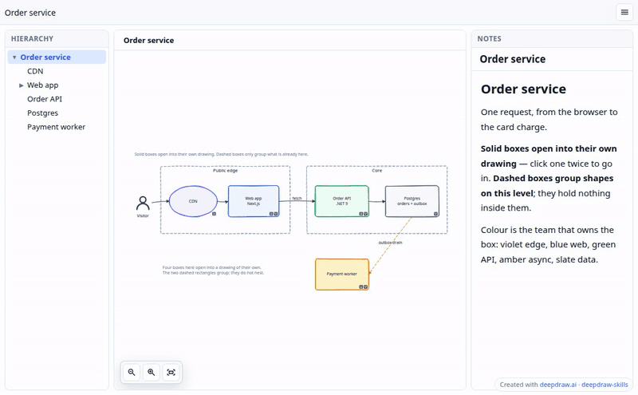
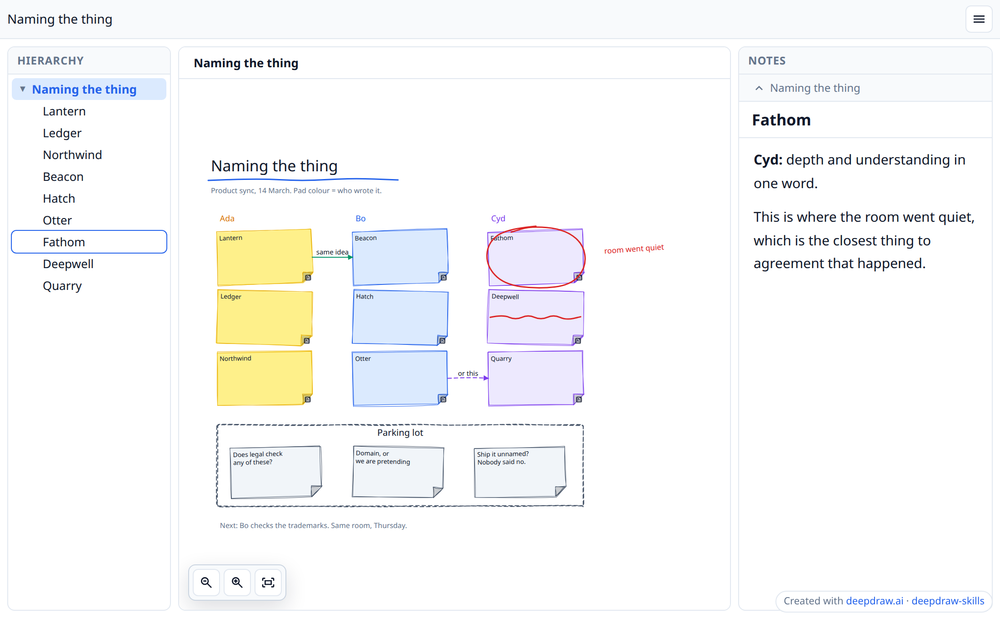

# deepdraw-skills

An agent skill for [**DeepDraw**](https://deepdraw.app): interactive and nested
drawings, with markdown. 

**AND you can edit these drawings manually afterwards.**

Great for software architecture, brainstorms and organizing knowledge visually.



Every shape can contain markdown and potentially drawing inside.



## Install

The skill is the `skills/deepdraw/` directory. Every agent below reads the same
`SKILL.md`; they only disagree about where to put it.

### Claude Code

One command, from inside Claude Code:

```
/plugin marketplace add philter87/deepdraw-skills
/plugin install deepdraw@deepdraw-skills
```

Or copy it in by hand. `~/.claude/skills/` for every project, `.claude/skills/`
for one:

```bash
git clone https://github.com/philter87/deepdraw-skills
mkdir -p ~/.claude/skills && cp -r deepdraw-skills/skills/deepdraw ~/.claude/skills/
```

### GitHub Copilot

```bash
git clone https://github.com/philter87/deepdraw-skills
mkdir -p ~/.copilot/skills && cp -r deepdraw-skills/skills/deepdraw ~/.copilot/skills/
```

Per repository instead: `.github/skills/deepdraw/`.

### Codex

```bash
git clone https://github.com/philter87/deepdraw-skills
mkdir -p ~/.agents/skills && cp -r deepdraw-skills/skills/deepdraw ~/.agents/skills/
```

Per repository instead: `.agents/skills/deepdraw/`.

`~/.agents/skills/` is read by Copilot as well, so one copy there covers both.

## Use

Trigger it deliberately, with the subject after the command:

```
/deepdraw the checkout service and how it talks to payments
```

`/deepdraw` in Claude Code, `$deepdraw` in Codex, `/deepdraw` in Copilot.

The skill sets `disable-model-invocation: true`, so in Claude Code it never
fires on its own: asking for "a diagram" gets you a diagram some other way until
you type the command. Copilot and Codex ignore that field and may still pick the
skill up from its description.

Nothing to install beyond Python 3. Pictures are scaled and re-encoded with
[Pillow](https://pypi.org/project/Pillow/) when it is importable — without it
they still go in, at whatever size they came in at.

## What you get back

Two files beside each other:

- `drawing.deepdraw.html`, the page. It needs no network and no server, and the
  whole drawing — pictures and icons included — travels inside it. **You can
  edit it**: it opens in edit mode, with a Save button that writes back to the
  file.
- `drawing.deepdraw.json`, the same drawing as JSON. It carries **only what the
  drawing set**, since DeepDraw fills its own defaults in wherever a document is
  read, so it is about half the size of a full export and small enough to read
  and edit by hand.

You can also edit, share and collaborate with others by importing it into deepdraw.app through **☰ → Import…**.

The two drawings in the screenshots are in
[`skills/deepdraw/examples/`](skills/deepdraw/examples); build one to see it:

```bash
python3 skills/deepdraw/build.py skills/deepdraw/examples/brainstorm.deepdraw.json
```

## Licence

MIT. DeepDraw itself is a separate project; the library bundled inside
`skills/deepdraw/reference/template.html` belongs to it.
